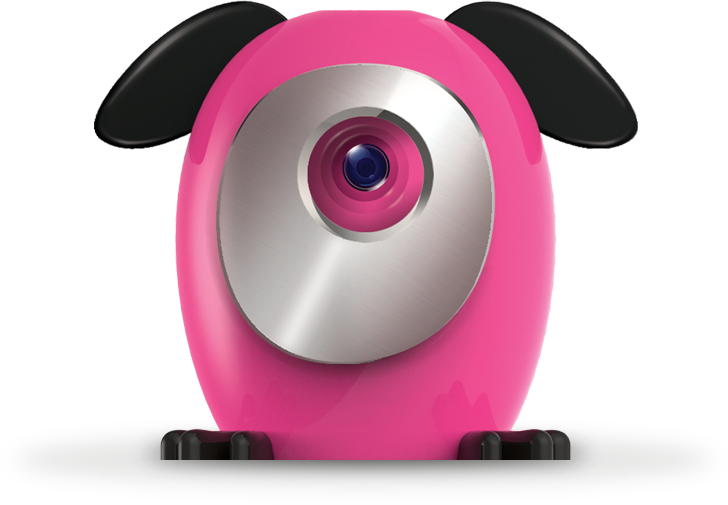
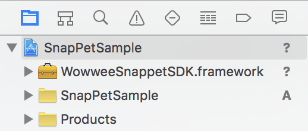
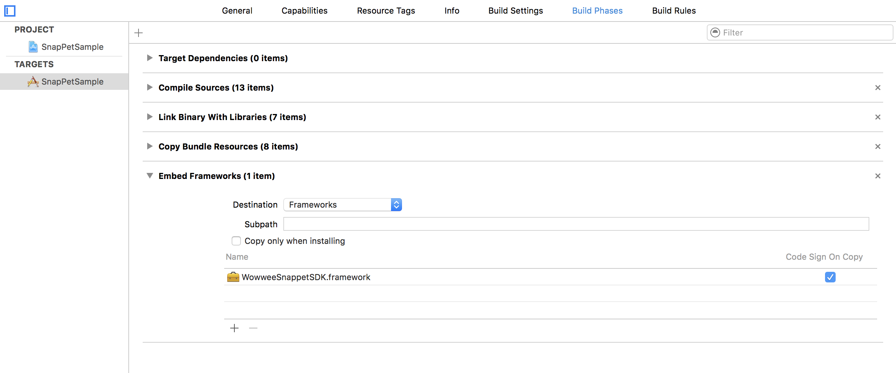
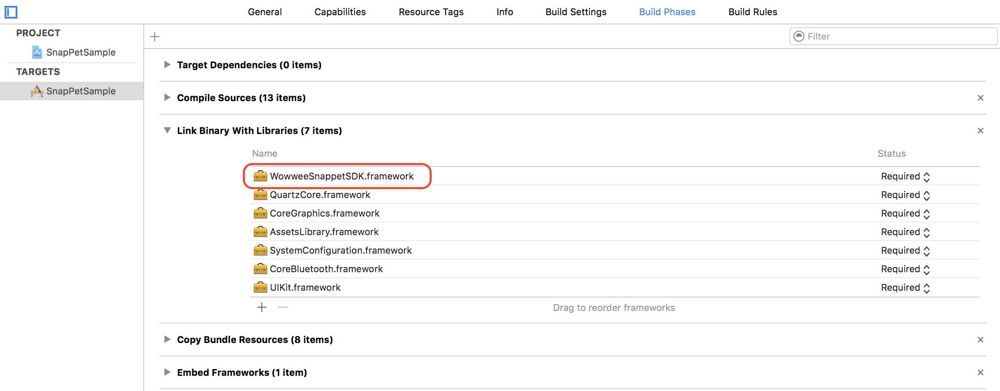

WowWee SnapPet iOS SDK
================================

The free SnapPets iOS SDK lets you control your [WowWee SnapPets](http://wowwee.com/snappets/) on devices running iOS 8.0 and above and Xcode 6. To use this SDK you will also need a physical SnapPets camera.

Pre-built official SDKs are also available for [Android](https://github.com/WowWeeLabs/SnapPets-Android-SDK).

For information on WowWee products visit: <http://www.wowwee.com>

Table of Contents
---------------------------------------

- [Quick Installation](#quick-installation)
- [Notes about the SDK](#notes-about-the-sdk)
- [Using the SDK](#using-the-sdk)
	- [Finding a SnapPets](#finding-snappets)
- [License](#license)
- [Contributing](#contributing)
- [Credits](#credits)
- [Projects using this SDK](#projects-using-this-sdk)

Quick Installation
---------------------------------

1. Clone the repository

		git clone https://github.com/WowWeeLabs/SnapPets-iOS-SDK.git

2. In XCode, create a new project. The simplest application is a Single-View application.

3. Open the project navigator in Xcode and drag the **WowweeSnappetSDK.framework** file from the Mac OS Finder to the Frameworks directory for your project in XCode.

4. Confirm that the framework is added to your project by going into _Project Settings_ (first item in the project navigator), then click the first target (e.g. _SnapPetSampleProject_), then _Build Phases_. If there is not a _"Embed Frameworks"_ phase., click the top left + to add one. Set the destination to _"Frameworks"_ and add the framework file under the _"Name"_ section.

Also make that the framework is present under the _"Link Binary With Libraries"_ section.
	

5. In the ViewController.h file, add the following line at the top of the file:

			#import <WowweeSnappetSDK/WowweeSnappetSDK.h>
	
Alternatively you can add this line into your Project-Prefix.pch (e.g. _SnapPetSample-Prefix.pch_) file so that you don't need to import in each class your planning to use the SDK in.
	
6. Check that the project compiles successfully after completing the above steps by pressing ⌘+b in Xcode to build the project. The project should build successfully.

7. Choose the classes you want to handle the delegate callbacks from a SnapPets, these classes will receive callbacks for when events happen (such as finding a new SnapPets, connected SnapPets, taking photo etc) in this case we will simply choose our ViewController.

To receive SnapPets Finder notifications, in the ViewController.h file, modify the following sections:
	
		- (void)viewDidAppear:(BOOL)animated {
		  	[super viewDidAppear:animated];
		  	
			// listen for callbacks
			[[NSNotificationCenter defaultCenter] addObserver:self selector:@selector(onSnappetRobotFinderNotification:) name:SnappetRobotFinderNotificationID object:nil];
		  	
		  	// Scan for SnapPets
		  	[[SnappetRobotFinder sharedInstance] scanForSnappetsForDuration:5];
		}

		- (void)viewWillDisappear:(BOOL)animated {
    		[super viewWillDisappear:animated];
    		[[NSNotificationCenter defaultCenter] removeObserver:self name:SnappetRobotFinderNotificationID object:nil];
		}
		
		- (void)onSnappetRobotFinderNotification: (NSNotification *)notification {
			NSDictionary *noteDict = note.userInfo;
			if (!noteDict || !noteDict[@"code"]) {
				// Looks like an invalid notification
			    return;
			}
			SnappetRobotFinderNote noteType = (SnappetRobotFinderNote)[noteDict[@"code"] integerValue];

			if (noteType == SnappetRobotFinderNote_SnappetFound) {
				if([[[SnappetRobotFinder sharedInstance] snappetsFound] count] > 0) {
				    SnappetRobot *snappet = [[[SnappetRobotFinder sharedInstance] snappetsFound] objectAtIndex:0];
				    // Connect to the first SnapPets found
				    snappet.delegate = self;
					// TODO: change this if you don't need to automatically connect to first SnapPets
				    [snappet connect];
				}
			} else if (noteType == SnappetRobotFinderNote_BluetoothError) {
			    CBCentralManagerState errorCode = (CBCentralManagerState)[noteDict[@"data"] integerValue];
			    if (errorCode == CBCentralManagerStateUnsupported) {
			        NSLog(@"Bluetooth Unsupported on this device");
			    } else if (errorCode == CBCentralManagerStatePoweredOff) {
			        NSLog(@"Bluetooth is turned off");
		        }
			}
		}

    To receive SnapPets callbacks, in the ViewController.h file, change the interface to match the following:

		@interface ViewController <SnappetRobotDelegate>
	
	In the interface definition add the following callbacks:
	
		- (void) SnappetDeviceReady:(SnappetRobot *)snappet {
			NSLog(@"We are connected to SnapPets and ready to go");
		}

		- (void) SnappetDeviceDisconnected:(SnappetRobot *)snappet error:(NSError *)error {
			NSLog(@"A SnapPets was disconnected");
		}

8. You should be now ready to go! Plug in an iOS device then compile and run the project using ⌘+r . When you turn on a SnapPets you should see some debug messages in the logs.

Using the SDK
---------------------------------

### Finding SnapPets
Once your application is listening to notifications, you need to issue the following call:

	[[SnappetRobotFinder sharedInstance] scanForSnappets];

Scanning is battery intensive so we recommend you don't continuously scan, instead you can use this to scan for 5 seconds then stop:

	[[SnappetRobotFinder sharedInstance] scanForSnappetsForDuration:5];

After a SnapPets is found, the SnappetRobotFinder will send a notification with the following dictionary for the notification userInfo 

	{
		"code": SnappetRobotFinderNote_SnappetFound,
		"data": <SnappetRobot>		
	}

You can handle this notification using the following snippet from the sample project

	- (void)snappetFoundNotification:(NSNotification *)note {
		if (noteType == SnappetRobotFinderNote_SnappetFound) {
	        SnappetRobot *snappet = noteDict[@"data"];
	        NSLog(@"Found: %@", snappet);
	    }
	}

In our sample project we automatically connect to the first SnapPets we find, however you can store these references and use them later, there is no need to connect initially. 

#### Special Note about using SnappetRobot objects
When SnapPets are no longer available (e.g. the player turns one off), they will still contain a valid SnappetRobot instance object. The only way to know if the SnappetRobot is available is to try to connect to it, or do another scan.

Notes about the SDK
---------------------------------

### CocoaPods Compatible

For now we do not support CocoaPods. Pull requests are welcome.

### Simulator Support

Our SDK fully builds for the simulator, however at present the IOS simulator does not support Bluetooth Low Energy. This means you will not be able to properly test the functionality without using a real IOS device.

### Submitting to the AppStore

Our SDK is a universal build which means it includes support for all platforms. Currently however Apple does not allow frameworks which contain simulator support to be submitted to the appstore. We provide a special framework for this purpose, but also it's very easy to do yourself. You can use the lipo tool provided on OSX.

    lipo -remove i386 -remove x86_64 WowweeSnappetSDK -output WowweeSnappetSDK

### Apple Watch Support

At present we don't have an Apple Watch device to test with. When it becomes available we are open to adding support for WatchKit.

### Full Source Code

At this stage we do not plan on releasing our full library source code. 

### Are there any restrictions on releasing my own application?

The SDK is currently and will always be free for you to build and release your own applications. Your welcome to charge money or release free applications using our SDK without restrictions.

If you create a great application, all we ask is that you provide a link for people to purchase their own SnapPets so they can enjoy your product.

### OSX Support

Currently the SDK is not available for OSX however we will make this available if it's important to you. If that's the case please open up an issue in the bug tracker.
.
### Can I use your cool joystick class?

Yes we have provided the source code in our sample project, feel free to use this or make changes as you want. We would love pull requests.

License
---------------------------------
SnapPets iOS SDK is available under the Apache License, Version 2.0 license. See the [LICENSE.txt](https://raw.githubusercontent.com/WowWeeLabs/SnapPets-iOS-SDK/master/LICENSE.md) file for more info.

You are free to use our SDK in your own projects whether free or paid. There are no restrictions on releasing into the Apple App Store or Google Play.

Contributing
---------------------------------
We happily accept any pull requests and monitor issues on GitHub regularly. Please feel free to give us your suggestions or enhancements. Please note that due to resource constraints we most likely cannot add new features to the SnapPets himself, but we will certainly consider them for inclusion to future versions.

Tell your friends, fork our project, buy our robot and share with us your own projects! These are the best kinds of positive feedback to us.

Credits
---------------------------------
* [YMSCoreBluetooth](https://github.com/kickingvegas/YmsCoreBluetooth.git) & [Our Fork](https://github.com/WowWeeLabs/YmsCoreBluetooth)
* [MSWeakTimer](https://github.com/mindsnacks/MSWeakTimer)
* [NSTimer-Blocks](https://github.com/jivadevoe/NSTimer-Blocks)
* [OWQueueStack](https://github.com/yangyubo/OWQueueStack)

Projects using this SDK
---------------------------------
* [WowWee SnapPets Official App](https://itunes.apple.com/us/app/snap-pets/id960996059?mt=8) - Official app developed by WowWee using this SDK.
* Send us a pull request to add your app here
